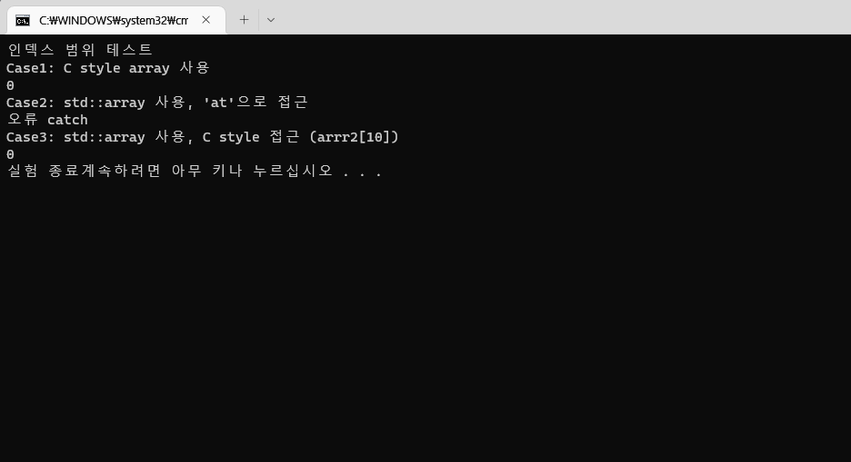

# C 스타일 배열과 std::array의 차이

C 스타일 배열은 인덱스를 검사하지 않는다. 

std::array는 인덱스를 검사하는 `at()` 함수를 제공하지만, C스타일의 `[]`(대괄호)를 사용한 접근도 제공한다.

이 세가지 방법에 대해 비교해보았다.


```cpp
#include <iostream>
#include <array>

int main()
{
	std::cout << "인덱스 범위 테스트" << std::endl;

	int arr1[10];				// C style array
	std::array<int, 10> arr2;	// Cpp style array
	
	std::cout << "Case1: C style array 사용" << std::endl;
		try
		{
			std::cout << arr1[10] << std::endl;
		}
		catch (...)
		{
			std::cout << "오류 catch" << std::endl;
		}

	std::cout << "Case2: std::array 사용, 'at'으로 접근" << std::endl;
		try
		{
			std::cout << arr2.at(10) << std::endl;
		}
		catch (...)
		{
			std::cout << "오류 catch" << std::endl;
		}

	std::cout << "Case3: std::array 사용, C style 접근 (arrr2[10])" << std::endl;
		try
		{
			std::cout << arr2[10] << std::endl;
		}
		catch(...)
		{
			std::cout<< "오류 catch" << std::endl;
		}

	std::cout << "실험 종료";
	return 0;
}
```


결과는 다음과 같다.


우선, Case1의 결과에서 C 스타일 배열이 인덱스를 검사하지 않고 정상적으로 프로그램 진행이 이어지는 것을 확인할 수 있고, Case2의 결과에서 `at()`으로 인덱스의 범위가 정상 범위에서 벗어나면 오류를 발생시킨다는 것을 확인할 수 있었다.

그런데 왜 Case3에서의 오류는 try-catch문으로 잡히지 않고 오류창을 띄우는 걸까?


그건 Visual studio의 Debug 모드로 빌드하였기 때문인 듯.

아무래도 Debug 모드에서는 std::array의 인덱스 범위를 검사하는 기능이 들어있는 모양이다.




Release 모드로 빌드하니 (잘못된 값을 읽으면서) 멀쩡히 돌아가는 것을 확인할 수 있었다.

