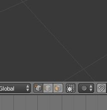

# Blender Edit Mode

Vertex : 점

Edge : 선

Face : 면

Edit Mode에서는 위의 세가지 요소를 조종하여 원하는 모양을 만들어 낼 수 있다. 

### 선택

Vertex를 조종하려면 Vertex를 선택해야 되는데, Vertex를 선택하려면 현재의 선택 모드가 Vertex select로 되어있어야 한다. Edge와 Face도 마찬가지다. 

선택 모드는 3D view - Header - Select Mode 로 설정할 수 있다.

현재 Vertex select 로 설정되어있는 모습.

Edit Mode에서 단축키 Ctrl+Tab으로도 선택모드를 바꿀 수 있다.

각 선택모드에서 Vertex, Edge, Face를 선택하고, 이동하는 것은 Object Mode에서과 똑같다. A키로 모두 선택, 우클릭으로 선택, G로 이동, R로 회전. S로 크기 조절.

Shift키를 누른 상태에서는 다중선택도 할 수 있는데, 이웃한 Vertex를 두개 선택하면 Edge모드에서 해당 Edge를 선택한 것과 똑같다. 사각형의 네 Vertex를 선택하면 Face모드에서 사각형을 하나 선택한 것과 똑같다. 그러므로 Vertex select로 작업 중 Face를 선택하기 위해 Face select로 선택모드를 바꿀 필요가 없다. 선택은 자유다.

선택 모드 자체도 다중 선택이 가능하다. Shift를 누를 상태로 Header의 아이콘 세개를 전부 클릭하면 마우스 우클릭시의 위치에 따라 Vertex, Edge, Face중 적당한 한개가 선택된다. 

