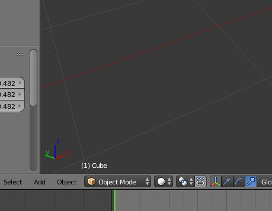

# Blender 모드

블렌더에는 3가지 모드가 있다. ~~아니 사실 더있긴 한데~~

* Object Mode : 블렌더 시작 시 기본으로 설정된 모드. 오브젝트 생성, 오브젝트간의 작업 등을 할 수 있다.
* Edit Mode : 모델링을 하기 위한 주요한 Mode이며, Vertex, Edge, Face를 제어하여 모델링함.
* Sculpt Mode : Zbrush같이 조각하여 모델링하는 방식

Mode의 전환은 3D View - Header - 모드 변경 버튼을 활용하여 할 수 있다.

지금은 Object Mode로 설정되어 있다.

주로 사용되는 Object Mode 와 Edit Mode는 Tab키로 전환할 수 있다.

사실, 다른 모드에서도 Tab키를 누르면 Edit Mode로 전환되고 한번 더 눌러서 돌아올 수 있다.

다만 Edit Mode에서 Tab을 누르면 Object Mode로 전환되기 때문에 Tab키를 눌러서 서로 바뀔 수 있는 게 확실한 것은 Object Mode와 Edit Mode의 둘인 것.

