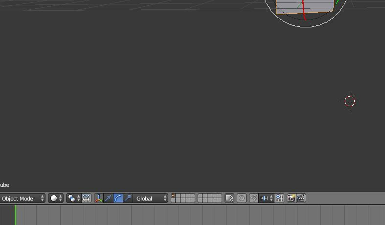

# Blender 오브젝트 제어

### 오브젝트 선택

마우스 우클릭: 오브젝트 선택. 쉬프트로 다중 선택/선택해제 가능

B + 마우스 왼쪽 드래그 : 지정 영역내 오브젝트 선택

C, 마우스 좌클릭 or 드래그 : 마우스 주위 영역 내의 오브젝트 선택. 마우스 스크롤이나 Num +/- 로 크기 조절 가능. 쉬프트로 선택 해제 가능

Ctrl + 마우스 왼쪽 드래그 : 그린 도형 안쪽의 오브젝트 선택. +Shift로 선택 해제 가능

A: 모두 선택

### 오브젝트 이동

오브젝트 선택 후 G : 마우스로 움직이고 좌클릭으로 오브젝트의 위치 지정. 우클릭으로 취소

오브젝트 선택 후 G 후 X or Y or Z : 오브젝트를 X, Y, Z 축에 따라 이동

오브젝트 선택 후 G 후 마우스 가운데 클릭 or 드래그 : 오브젝트를 자동으로 지정된 축 (X,Y,Z 중 하나)에 따라 이동. 

### 오브젝트 회전

오브젝트 선택 후 R : 마우스로 회전시키고 좌클릭으로 지정. 우클릭으로 취소

오브젝트 선택 후 R 후 X or Y or Z : 오브젝트를 X, Y, Z 축에 따라 회전

오브젝트 선택 후 R 후 마우스 가운데 클릭 or 드래그 : 오브젝트를 자동으로 지정된 축에 따라 회전. 

### Manipulator Widget

오브젝트를 선택시 선택된 오브젝트를 중심으로 표시되는 위젯. 위젯의 종류에 따라 위치 이동, 회전, 확대/축소 를 쉽게 할 수 있다. 

기본적으로 이동으로 설정되어있으며, 3D View의 Header에 있는 아이콘을 눌러 끄거나 변경할 수 있음.

위젯이 Rotate로 설정되어있는 모습

위젯 표시 여부는 Shift로 다중 설정도 가능하다.

위젯은 가운데와 3개의 축으로 구성된다. 3개의 축중 하나를 선택하면 한 개의 축을 대상으로 할 수 있고, 가운데를 클릭&드래그하면 3개의 축 전부에 대해서 이동,회전, 확대/축소 할 수 있다.