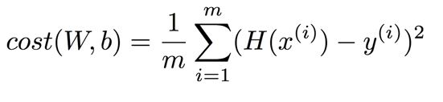

Linear Regression : 선형 회귀?

자료는 X와 Y 두개의 축을 가지고 있다.

X에는 주어지는 데이터, Y에는 X를 통해 도출되는, 학습하여 결과를 도출할 데이터를 준다.

Linear Regression의 Hypothesis

* `H(x) = Wx+b`

Cost function (=Loss function)

* (H(x)-y)^2 
* 위 식을 사용하여 가설식에 x값을 넣고 데이터 테이블의 y값과 차이가 얼마나 나는지 비교한다.
* 즉, 가설식의 그래프가 실제 데이터의 그래프와 얼마나 유사한지 알 수 있다.
* 주어진 자료의 전체에 대하여 위 식을 적용하고 그 값들에 평균을 내면 아래와 같다.
* 

Linear Regression에서의 목표는 위 식의 cost(W,b)를 최소화하는 것이다.

