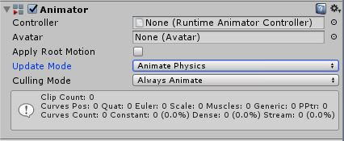

# Unity 공부\_컴포넌트\_Animator

Animator는 유니티 애니메이션 시스템의 일부이다. 

애니메이터 컨트롤러(.controller 파일)에서 설정된 바에 따라 애니메이션 클립을 재생해주는 역할을 한다.

애니메이션 클립의 생성은 Animation 창에서 할 수 있고, 애니메이터 컨트롤러의 설정은 Animator 창에서 할 수 있으며, 게임오브젝트에 Animator 컴포넌트를 추가함으로 해당 게임오브젝트에서 애니메이션을 재생할 수 있다.

## Controller 

해당 게임오브젝트의 애니메이션을 제어하는 데 쓰일 애니메이터 컨트롤러(.controller 파일)을 지정할 수 있다.

## Avatar

캐릭터의 아바타입니다.(애니메이터가 휴머노이드 캐럭터를 애니메이션화하기 위해 사용되는 경우)

3D 모델로 애니메이션을 만들기 위해 사용되는 일종의 골격(또는 스켈레톤)이라고 생각하면 될 것 같습니다.

## Apply Root Motion

캐릭터의 포지션과 회전을 애니메이션 자체에서 제어할지 또는 스크립트에서 제어할지 여부입니다.

## Update Mode

애니메이터 업데이트를 언제 할지, 어떤 타임스케일을 사용할지 선택할 수 있게 해줍니다.

* Normal: 애니메이터의 업데이트가 Update 호출과 싱크되어 업데이트됩니다. 즉, TimeScale의 영향을 받습니다.
* Animate Physics: 애니메이터의 업데이트가 FixedUpdate 호출과 싱크되어 업데이트됩니다. 즉, 물리 시스템과 같이 업데이트되며, 물리 상호작용을 하는 오브젝트의 모션을 애니메이션화하는 경우에 사용합니다.
* Unscaled Time: 애니메이터의 업데이트가 Update 호출에 따라 이루어지지만 현재의 TimeScale을 무시하고 항상 100%의 속도로 애니메이션을 재생합니다. 게임을 일시정지하거나 특수한 효과를 위해 수정된 타임스케일을 사용하면서 GUI 시스템을 보통의 속도로 애니메이션화하는 경우에 유용합니다.

## Culling Mode

* Always Animate: 항상 애니메이션화하고 off-screen일 경우에도 컬링(생략)을 하지 않습니다.
* Cull Update Transforms: 렌더러가 보이지 않을 때 리타겟, IK 및 트랜스폼의 쓰기를 비활성화합니다.
* Cull Completely: 렌더러가 보이지 않을 때 애니메이션을 완전히 비활성화합니다.

그 외 여러가지 데이터들이 표시되는 공간이 있지만 완벽히 이해하지 못한 관계로 유니티 공식 문서에서 복붙만 합니다.

| **Clip Count**                | 해당 애니메이터에 할당된 애니메이터 컨트롤러가 사용하는 애니메이션 클립의 총 개수. |
| ----------------------------- | ------------------------------------------------------------ |
| **Curves (Pos, Rot & Scale)** | 오브젝트의 포지션, 회전, 스케일을 애니메이션화하는 데 사용하는 커브의 총 개수. 일반적인 휴머노이드 리그에 포함되지 않는 애니메이션화한 오브젝트의 커브를 의미합니다. 휴머노이드 아바타를 애니메이션화했을 때 꼬리라든지 흩날리는 천 또는 달랑거리는 펜던트와 같은 추가적인 비근육 뼈대의 개수를 표시합니다. 휴머노이드 애니메이션을 가지고 있는데 예기치 않은 비근육 애니메이션 커브를 감지했을 경우에는 파일에 불필요한 애니메이션 커브가 있을 수도 있습니다. |
| **Muscles**                   | 애니메이터가 휴머노이드 애니메이션에서 사용하는 머슬 애니메이션 커브의 수. 일반적인 휴머노이드 아바타 머슬을 애니메이션화하는 데 사용되는 커브입니다. Unity 표준 아바타가 가진 모든 휴머노이드 뼈대에 사용되는 표준 머슬 움직임 뿐만 아니라 루트 모션 포지션 및 회전 애니메이션을 가지고 있는 두 개의 “머슬 커브”도 포함됩니다. |
| **Generic**                   | 머티리얼 컬러와 같은 다른 프로퍼티를 애니메이션화할 때 사용되는 숫자(플로트) 커브의 개수. |
| **PPtr**                      | 스프라이트 애니메이션 커브의(Unity 2D 시스템에서 사용됨) 총 개수 |
| **Curves Count**              | 애니메이션 커브의 전체 개수 합계                             |
| **Constant**                  | 상수(불변)값으로 최적화된 애니메이션 커브의 개수. 애니메이션 파일에 변하지 않는 값이 포함되어 있는 경우 Unity는 자동으로 이 값을 선택합니다. |
| **Dense**                     | 저장된 데이터(선형적으로 보간된 이산된 값들)들이 “밀도” 메서드에 의해 최적화된 애니메이션 커브의 개수. 이 메서드는 “스트림” 메서드에 비해 메모리 사용이 훨씬 적습니다. |
| **Stream**                    | 데이터를(커브된 보간의 탄젠트 데이터와 시간이 포함된 값) 저장할 때 “스트림” 메서드를 사용하는 애니메이션 커브의 개수. 이 데이터는 “밀도” 메서드에 비해 메모리를 훨씬 더 많이 차지합니다. |