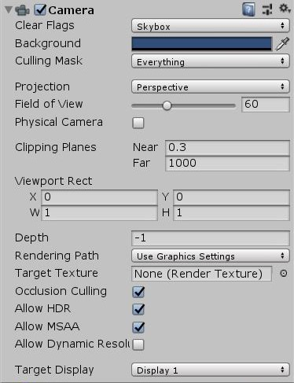

# Unity 공부\_컴포넌트\_Camera

## Clear Flags

카메라에 잡히는 오브젝트가 없을 때 해당 부위(픽셀)을 처리하는 방식을 선택합니다.

* Skybox : 모든 오브젝트 뒤에 표시되는 정육면체의 스카이박스가 있다고 가정합니다.

* Solid Color : 단색으로 처리합니다. 이 색은 Background에서 지정된 색을 따릅니다.

* Depth only : 빈 공간을 투명색으로 처리합니다. 아래의 Culling Mask와 함께 사용되는 경우가 많습니다.

* Don't Clear : 빈 공간을  Clear하지 않습니다. 마지막으로 표시된 색깔이 유지됩니다.

  

## Background

Clear Flags에서 Solid Color를 선택했을 때 나오는 색입니다. Clear Flags가 Skybox 또는 Solid Color일 때에만 표시됩니다.

## Culling Mask

카메라에 랜더링 될 레이어들을 선택할 수 있습니다. 체크 해제된 레이어들은 해당 카메라로 보이지 않습니다.

## Projection

투사 모드를 선택합니다. 원근법을 적용할지의 여부를 선택합니다.

* Perspective : 원근법을 적용합니다. 가까이 있을 수록 크게 보입니다.
* Orthographic : 원근법을 적용하지 않습니다. 카메라와의 거리와 상관 없이 크기가 똑같이 보입니다.

## Field of View

카메라의 시야각을 조절할 수 있습니다. Projection이 Perspective일 때에만 표시됩니다.

Field of View의 값이 클 수록 넓은 시야각을 가지며 사물이 작게 보입니다.

기본값은 60이며, VR게임에서 120 정도의 값을 사용합니다.

## Physical Camera

Projection이 Perspective일 때에만 표시됩니다.

## Size

카메라가 잡아내는 수평너비입니다. Projection이 Orthographic일 때에만 표시됩니다.

기본값은 5이며 값이 클수록 화면에 오브젝트가 작게 표시됩니다.

## Clipping Planes

랜더링되는 거리의 범위를 설정합니다.

* Near : 카메라와의 거리가 Near값보다 작을 경우 렌더링 되지 않습니다.
* Far : 카메라와의 거리가 Far값보다 클 경우 렌더링 되지 않습니다. 시야거리라고도 볼 수 있습니다.

## Viewport Rect

카메라를 통해 렌더링 된 이미지가 화면의 어디에 얼만큼의 크기로 표시될 지를 나타냅니다.

* X : 0~1까지의 값을 가지며 X값이 클수록 카메라를 통해 잡힌 영상이 화면의 오른쪽에 표시됩니다. 기본값은 0입니다.
* Y : 0~1까지의 값을 가지며 Y값이 클수록 카메라를 통해 잡힌 영상이 화면의 위쪽에 표시됩니다. 기본값은 0입니다.
* W : 0~1까지의 값을 가지며 W값이 클수록 카메라를 통해 잡힌 영상이 화면에 가로로 넓게 표시됩니다. 기본값은 1입니다.
* H : 0~1까지의 값을 가지며 H값이 클수록 카메라를 통해 잡힌 영상이 화면에 세로로 넓게 표시됩니다. 기본값은 1입니다.

가령 예를 들어 X값이 0.5, W값이 각각 0, 0.5인 카메라 두개가 있으면 화면을 반으로 분할하여 2인 플레이가 가능합니다. 미니맵을 만드는 용도로도 사용할 수 있습니다.

## Depth

그리기 순서에서 카메라의 위치입니다. 큰 값의 카메라가 작은 값의 카메라에 그려집니다

## Rendering Path

카메라가 사용하는 랜더링 방식을 결정하는 옵션입니다.

* Use Graphics Settings : Edit-Preference-GraphicsSettings에서 설정된 것을 따릅니다.
* Forward : 포워드 랜더링을 사용합니다. 포워드 랜더링은 해당 라이트에 영향을 받지 않아도, 화면에 랜더링되지 않는 면도 연산을 실행합니다. 
* Deferred : 지연 랜더링을 사용합니다. 지연 셰이딩은 조명 랜더링을 미루어서 일단 조명 없이 렌더링을 한 뒤, 렌더 대기열 끝에서 조명 랜더링을 실행하는 방식입니다. 카메라에 보이지 않는 부위를 연산할 필요가 없습니다. 하드웨어가 지원하지 않으면 사용할 수 없습니다. 또한 반투명한 물체를 랜더링할 때 어려움이 있습니다. 
* Legacy Vertex Lit
* Legacy Deferred (light prepass)

참고 : Projection이 Orthographic일 경우 이 값은 오버라이드 되며 카메라는 항상 포워드 랜더링을 사용합니다.

## Target Texture

텍스쳐를 지정하여 카메라 화면을 그 텍스쳐로 붙여넣을 수 있습니다. 야구장의 중계 스크린, 거울 등에 사용할 수 있습니다. 

## Occlusion Culling

Occlusion Culling 옵션이 체크되어 있을 경우 앞 사물에 의해 가려진 뒷 사물을 렌더링하지 않습니다. 

## Allow HDR

HDR(High Dynamic Range) 랜더링을 활성화합니다. HDR 랜더링이 꺼져있으면, 화면내 RGB의 값이 내부적으로 0에서 1 사이의 값으로 표시됩니다. 그러나 주변 광원 상황으로 인해 어두운 방에서 흰색(1,1,1)으로 보이는 사물이 밝은 곳에서 회색(0.8,0.8,0.8)으로 표시되는 사물보다 실제로는 더 어두울 수 있습니다. 픽셀 값의 범위가 실제 광원을 더 정확하게 표현하도록 하기 위해 RGB가 0에서 1 범위 밖의 값을 사용할 수 있도록 것이 HDR 랜더링입니다. 

하지만 어차피 나중엔 디스플레이 장치에서 사용 가능한 범위로 매핑(mapping)해야 합니다.

## Target Display

어떤 외부 장치를 랜더링할 것인지 결정합니다. 1~8의 값을 가집니다.