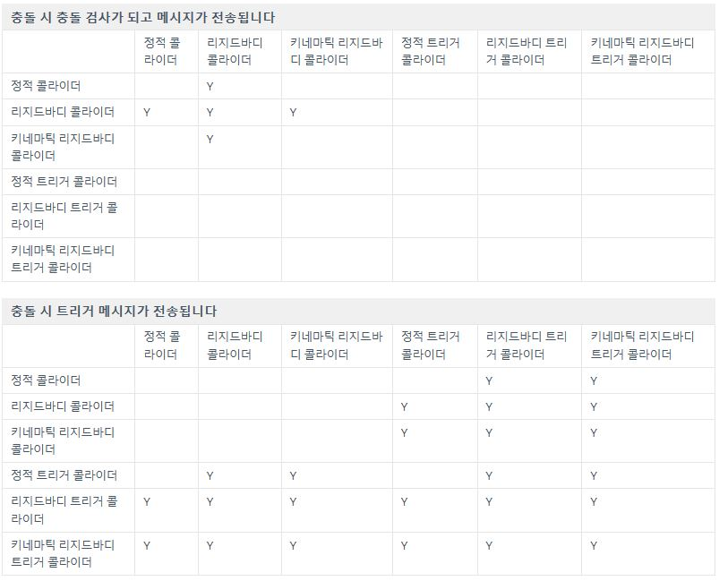

# Unity 공부\_컴포넌트_Collider

Collider는 유니티에서 충돌 감지를 담당하는 컴포넌트이다. 3D와 2D별로 사용되는 Collider가 다르며, 3D와 2D별로 각각 다양한 모양의 콜라이더를 제공하고 있다.

가능하다면 단순한 모양의 콜라이더를 사용하는 것이 최적화면에서 좋다.

Collider 컴포넌트는 그 특성상 Rigidbody 컴포넌트와 매우 밀접한 연관성을 가진다. Rigidbody 컴포넌트의 설정과 Collider 컴포넌트의 설정에 따라 3*2=6가지의 조합이 생겨나며 이는 다음과 같다.

* 정적 콜라이더
* (다이나믹) 리지드바이 콜라이더
* 키네마틱 리지드바디 콜라이더
* 정적 트리거 콜라이더
* 리지드바디 트리거 콜라이더
* 키네마틱 리지드바디 트리거 콜라이더

정적 (트리거) 콜라이더는 리지드바디가 붙어있지 않은 게임오브젝트의 콜라이더이다. 정적 (트리거)콜라이더끼리는 서로 충돌검사 및 (트리거)메세지 전송이 되지 않는다. 정적 오브젝트에는 물리가 적용되지 않는 것이 원칙이기 때문.

키네마틱 리지드바디 콜라이더는 (다이나믹) 리지드바디 콜라이더하고만 상호작용 할 수 있다. 

트리거 콜라이더는 서로 충돌 검사하지는 않지만(즉, 부딪히지는 않지만), 충돌 시(서로를 통과 시) 트리거 메시지가 전송된다. 현실에서 예를 찾자면 지하철 개표기에 무임승차하려고 하면 문이 닫히듯이, 특정한 공간을 다른 오브젝트가 지나갔을 때 이를 판별해주는 역할을 한다. 트리거 콜라이더는 다른 모든 콜라이더들과 상호작용(충돌시 트리거 메시지 전송)할 수 있지만 예외로 정적 트리거 콜라이더는 정적 (트리거) 콜라이더와 상호작용하지 않는다.

위 설명을 표로 요약하면 다음과 같다.

