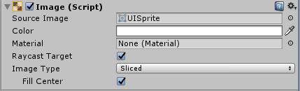

# Unity 공부_컴포넌트\_Image

Image 컴포넌트는 UI를 구성하는 데 있어서 필수적인 요소이므로 잘 알아둘 필요가 있다.

## Source Image

사용할 이미지를 지정한다. 스프라이트 형식.

## Color

Sprite Renderer에서의 Color옵션과 마찬가지로 Source Image에 곱해줄 색을 지정할 수 있다. 흰색(FFFFFFFF)일 경우 Surce Image를 그대로 사용하게 되며 검은색(000000FF)일 경우 Source Image의 검은 실루엣만 보이게 된다.

## Material

원하는 Material을 지정해줄 수 있다. 단, 기본 쉐이더(Standard Shader)를 사용할 경우 원하지 않는 결과가 나올 수 있으니 Meterial의 쉐이더 지정을 꼭 해줄 것

## Raycast Target

레이캐스팅 타겟으로 지정될지 여부. 보통이라면 UI에 레이캐스트를 적용할 일은 많이 없겠지만 예를 들어 UI가 World Space에 존재하는 VR게임 환경이라고 하면 레이캐스트가 유용할 것 같다.

## Image Type

Source Image를 어떻게 활용할 것인지 선택합니다.

* Simple: 단순히 크기를 늘립니다.
* Sliced: 스프라이트를 가로3*세로3 총 9조각으로 나누어서 (이를 9-slicing 이라고 합니다. Sprite Editor에서 초록색 점을 잡고 움직여서 9-slicing을 할 수 있습니다.) 왼쪽위, 오른쪽위, 왼쪽아래, 오른쪽아래의 4개는 그대로 두고 나머지 조각들만 크기를 조절해서 이미지 크기를 키웠을 때 모서리가 깨지지 않도록 합니다.
* Tiled: Sliced와 비슷하지만 확대하는 대신 조각들을 반복합니다.
* Filled: Source Image를 마치 그래프같이 취급합니다.(이하 후술) `Fill Amount`값에 따라 이미지의 모양이 바뀝니다.

#### Fill Method

`Image Type`가 Filled일 때만 사용가능한 옵션입니다. 말보단 한 번 해보는 게 이해가 쉬운 옵션들입니다.

* Horizontal: 스프라이트가 가로로 Fill Amount 만큼만 표시됩니다. 수평 방향으로 누운 막대그래프 같다고 생각하면 편합니다. 롤 체력 게이지라고 생각해도 될 것 같습니다. `Fill Origin`으로 왼쪽부터 표시할 지, 오른쪽부터 표시할 지 선택할 수 있습니다.
* Vertical: 스프라이트가 세로로 Fill Amount 만큼만 표시됩니다. 나머지는 `Horizontal`과 비슷합니다.
* Radial 90: 네개의 꼭짓점 중 `Fill Origin`을 통해 지정된 하나를 중심으로 [90*`Fill Amount`/90]만큼만 표시합니다. `Clockwise`옵션을 통해 어디서부터 표시될 지 정할 수 있습니다.
* Radial 180: 네 변의 중심점 중 `Fill Origin`을 통해 지정된 하나를 중심으로 [180*`Fill Amount`/180]만큼만 표시합니다. `Clockwise`옵션을 통해 어디서부터 표시될 지 정할 수 있습니다.
* Radial 360: 스프라이트의 중심점을 기준으로 [360*`Fill Amount`/360]만큼만 표시합니다. `Clockwise`옵션을 통해 어디서부터 표시될 지 정할 수 있으며, `Fill Origin`으로 어디서부터 표시를 시작할 지 정할 수 있습니다.

## Preserve Aspect

 Preserve Aspect 옵션을 선택하면 가로세로 비율을 원본 스프라이트의 비율로 유지합니다.