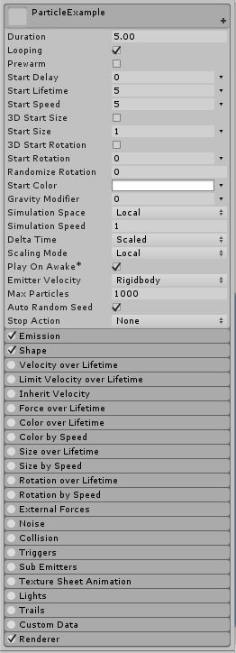

# Unity 공부\_컴포넌트\_Particle System

파티클은 파티클 시스템에 의해 대량으로 표시, 이동되는 작고 단순한 이미지 또는 메시입니다.

뭔가 자잘한 것들을 표현하고 싶을 때, 또는 연기 등과 같은 유체를 표현할 때 사용합니다.

파티클 시스템은 매우 많은 옵션을 제공한다. 모듈만 해도 십수개다. 적당히 살펴보도록 합시다.

## 메인 모듈

오른쪽에 작은 화살표 하나가 있는 옵션들은 고정 상수와 랜덤 값, 시간의 변화에 따른 그래프의 값 등 다양한 옵션 중 하나를 선택할 수 있는 녀석들이다.

* Duration : 파티클 시스템이 작동할 시간을 나타낸다. (단위 : 초)
* Looping : 반복작동의 여부
* Prewarm : 예열옵션. 활성화되어있을 경우 파티클 시스템이 활성화되자마자 한창 작동중이던 파티클시스템인 것 마냥 풍성한 양의 파티클을 볼 수 있다. 비활성화되어 있을 경우 파티클이 풍성해지기까지 시간이 걸리게 된다.
* Start Delay : 파티클 이펙트가 활성화되고 나서 파티클 생성을 시작하기까지의 딜레이. Duration에 포함되지 않는다. 가령 예를 들어 Duration이 5이고 StartDelay가 2일 경우 이 파티클 시스템의 한 사이클은 7초가 걸린다. 또한, Looping 옵션이 활성화되어있어도 최초 1회만 딜레이가 발생한다. 우측의 작은 화살표를 내려서 (Constant, Random Between Two Constants) 의 옵션을 선택할 수 있다. 
* Start Lifetime : 생성된 파티클이 사라질 때까지 걸리는 시간의 초기값. 우측의 작은 화살표를 내려서 (Constant, Curve, Random Between Two Constants, Random Between Two Curves) 의 옵션을 선택할 수 있다. 즉, 파티클마다 수명을 제각기 다르게 설정할 수 있다.
* Start Speed : 속도 초기값. 파티클이 생성되어서 공간 상에서 뻗어나가는 속도. 
* Start Size : 파티클 크기의 초기값. 위의 `3D Start Size`옵션이 `True`일 경우 X,Y,Z축 각각에 대해 크기를 조절할 수 있다.
* Start Rotation : 파티클 회전각도의 초기값. 기본적으로 Z축 값만 조절할 수 있으며, `3D Start Rotation`옵션이 `True`일 경우 X,Y,Z축 각각에 대해 회전량을 조절할 수 있다. 파티클은 카메라의 각도에 상관없이 일정하게 랜더링 되므로 Z축이 플레이어의 화면에 대해서 항상 수직이고 X, Y축은 플레이어의 화면에 대해서 항상 평행하다. 
* Randomize Rotation : 일부 파티클이 반대 방향으로 회전하게 합니다.
* Start Color : 각 파티클의 초기 컬러. 오른쪽의 화살표를 내려 Gradient로 설정하면 다른 옵션에서의 Curve와 같은 효과를 볼 수 있다. 그라디언트 바에 따라 시간이 지날 수록 생성되는 파티클의 색상이 바뀐다.
* Gravity Modifier : 물리 관리자에 설정되어 있는 중력 값을 스케일 합니다. 값을 0으로 설정하면 중력이 적용되지 않습니다. 
* Simulation Space : 파티클 시스템이 Local Space에서 시뮬레이션 될지(부모 오브젝트의 움직임에 따라 같이 움직일 지), 아니면 World Space에서 시뮬레이션 될지를 선택합니다. Custom 옵션을 선택하면 자기 부모 오브젝트(의 Transform)가 아닌 다른 오브젝트(의 Transform)를 마치 자신의 부모오브젝트마냥 따라다니게도 할 수 있습니다.
* Simulation Speed : 전체 파티클 시스템의 업데이트 속도를 조절.
* Delta time : Scaled를 선택하면 Time.TimeScale 값에 따라 속도가 변하고 Unscaled를 선택하면 시간관리자의 TimeScale값을 무시합니다. 예를 들어 일시정지 메뉴에 표시되는 파티클 시스템 등에 유용합니다.
* Scaling Mode : Local을 선택하면 파티클 시스템의 트랜스폼 스케일만 적용되고 부모는 무시됩니다. Hierarchy를 선택하면 부모의 트랜스폼에 영향을 받습니다. Shape를 선택하면 파티클의 시작포지션(Shape 모듈에서 결정하는 그것)이 트랜스폼의 영향을 받지만 파티클 자체의 크기에는 영향이 없습니다.
* Play on Awake : 활성화하면 오브젝트가 생성될 때 파티클 시스템이 자동으로 시작합니다. 
* Emitter Velocity : 파티클 시스템이 Inherit Velocity 모듈과 Emission 모듈에 사용할 속도를 계산하는 방법을 선택합니다. 시스템은 Rigidbody 컴포넌트(있을 때에 한함)를 사용하거나 Transform 컴포넌트의 움직임을 추적하여 속도를 계산할 수 있습니다.
* Max Particles : 해당 파티클 시스템에 한번에 포함될 수 있는 최대 파티클 수입니다. 한도에 도달하면 일부 파티클이 제거됩니다. 제거될 파티클을 선택하는 방법도 지정이 가능한걸로 알고 있었는데.... 잘 모르겠다.ㅜㅜ
* Auto Random Seed : 활성화하면 파티클 시스템을 재생할 때마다 파티클이 조금씩 다르게 생성됩니다. 비활성화하면 시스템을 아무리 재생해도 똑같이 보입니다.
* Stop Action : 시스템에 속한 모든 파티클이 완료되어 시스템이 중지되었을 때 특정 동작을 수행하도록 설정할 수 있습니다. None, Disable, Destory, Callback 중 하나를 선택할 수 있으며 Callback을 선택했을 경우 OnParticleSystemStopped 콜백을 게임오브젝트에 연결된 스크립트로 전송합니다.

### 오늘은 여기까지

