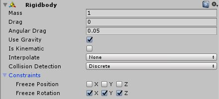

# Unity 공부\_컴포넌트\_Rigidbody

게임내의 물리 적용을 위해선 Rigidbody를 사용해야 하므로 물리가 중요한 (중요하지 않더라도 어쨋던 물리를 사용하는) 게임을 만들기 위해선 Rigidbody에 대한 이해가 필요하다.

## Mass

질량. 힘을 가했을 때 질량이 클 수록 가속도가 바뀌지 않음

## Drag

공기 저항. 힘으로 인해 물체가 움직이고 있을 때 서서히 멈추게 하는 정도. `Drag`가 무한대면 물체는 즉시 정지함.

## Angular Drag

회전에 대한 공기 저항. 오브젝트가 토크로 회전할 때 공기 저항이 영향을 미치는 정도. 단, `Angular Drag`가 무한이어도 `Drag`처럼 오브젝트의 회전을 멈추게 할 수는 없음.

## Use Gravity

중력 적용의 여부. 중력의 크기는 Edit-Project Settings-Physics 에서 변경할 수 있음.

## Is Kinematic

활성화되면 오브젝트가 `Kinematic Object`가 되며, 이 때는 오브젝트가 물리 엔진으로 제어되지 않고 오로지 Transform 으로만 조작됩니다. HingeJoint, 즉 관절이 있는 오브젝트를 애니메이션화하는 경우에 유용합니다.

## Interpolate

선택한 옵션에 따라 (예상되는 다음 프레임, 이전 프레임, 보간하지 않음)의 트랜스폼에 맞게 움직임을 부드럽게 처리합니다.

## Collision Detection

빠르게 움직이는 오브젝트가 충돌의 감지 없이 다른 오브젝트를 지나쳐가는 것을 방지합니다. 가령 Collision Detection이 `Discrete`이고, 크기가 1x1x1인 총알이 프레임당 100의 속도로 진행 중 100x100x1의 벽과 충돌 시 총알이 정지하도록 설정했을 때 총알이 벽을 뚫고 나갈 수 있습니다. 벽의 두께보다 총알의 프레임당 변위가 크기 때문입니다.

* Discrete: 불연속 충돌 검사를 합니다. 
* Continuous: 리지드바디가 있는 동적콜라이더에 불연속 충돌 검사를, 정적 메시 콜라이더에 연속 충돌 검사를 사용합니다. 퍼포먼스에 큰 영향을 줄 수 있습니다.
* Continuous Dynamic: `Continuous` 및 `Continuous Dynamic`으로 설정된 오브젝트와 정적 메시 콜라이더에 연속 충돌 검사를 하고 그 외의 콜라이더에는 불연속 충돌 검사를 사용합니다. `Continuous`옵션과 비교했을 때 `Discrete`로 설정된 오브젝트와 충돌할 때 연속 충돌 검사를 사용하지 않아도 된다는 차이가 있습니다.

## Constraints

리지드바디의 움직임에 제약 사항을 걸 수 있습니다. Position과 Rotation이 쓰는 좌표계가 다름에 유의!

* Freeze Position: 월드 좌표계에서 X, Y, Z 축 각각에 대한 이동을 멈추게 할 수 있습니다.
* Freeze Rotation: 로컬 좌표계에서 X, Y, Z 축 각각에 대한 회전을 멈추게 할 수 있습니다.

