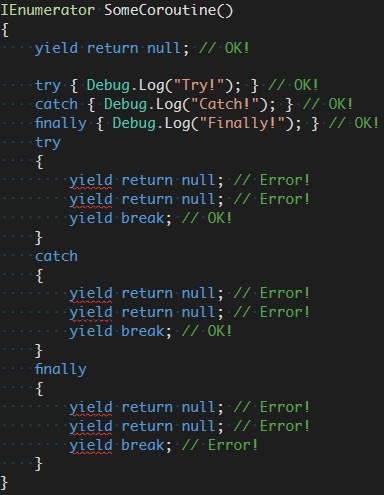

# Unity공부\_Scripting\_Coroutine

C#에는 코루틴이란 것이 존재한다. 개인적인 경험에 의거하면 코루틴은 주로 다음과 같은 경우에 쓰인다.

* 비동기적인 작업을 하려고 할 때
* 일정 시간(여러 프레임)에 걸쳐서 이뤄지는 일련의 작업을 수행할 때 

물론 아직 초보 프로그래머다 보니 정확하지는 않을 수 있다만 암튼 코루틴이 비동기적인 작업을 위해 쓰이는 것은 거의 사실이다.


코루틴의 사용방법은 다음과 같다.

```c#
void Start()
{
    float a=1;
    StartCoroutine(MyCoroutine(a));
    //or
    //StartCoroutine("MyCoroutine");
    //(전달할 인자가 없는 경우)
}

//코루틴 함수의 리턴형은 반드시 IEnumerator이다.
IEnumerator MyCoroutine(float waitTime)
{
    Debug.Log("Start Coroutine");
    //코루틴 함수에는 반드시 yield return 문이 포함되어야 한다.
    yield return new WaitForSeconds(WaitTime);
    Debug.Log("End Coroutine");
}
```

위 코드는 다음과 같은 동작을 수행한다.

1. 시작하자마자 코루틴을 호출한다.
2. 호출된 코루틴은 "Start Coroutine"을 출력한다.
3. a=1이므로 1초만큼 대기한다.
4. 코루틴이 "End Coroutine"을 출력한다.
5. 코루틴 종료


이론적인 부분을 짚지 않고 간단히 사용법만 알아보면 다음과 같다.

* IEnumerator형으로 코루틴함수를 선언한다.
* 코루틴에는 반드시 `yield return`(또는 `yield break`) 이 있어야 한다.
* `StartCoroutine( )`으로 선언한 코루틴을 실행한다.
* 코루틴 실행 중 `yield return`을 만나면 일단 멈춘다. 
* 만약 `yield return new WaitForSeconds(time)`라면 주어진 `time`만큼 대기한다.
* `yield return`문 다음 문장부터 이어서 처리한다.
* `yield break`를 만나면 코루틴을 아예 종료한다.


이정도만 알아도 사용하는데에는 큰 지장이 없지만 더 자세히 알아보도록 하자


우선 yield 구문부터.

yield라는 것은 반복자의 IEnumerator 객체에 값을 전달(yield)하거나, 반복의 종료를 알리기 위해 사용한다. 

유니티 코루틴에서는 다음과 같이 사용한다.

```c#
yield statement: 
	yield return object;     
	yield break;
```

여기서 yield 구문에는 몇 가지의 제약 사항이 존재한다.

1. 메서드 밖에서 yield를 쓰면 에러.
2. 익명 메서드 혹은 람다에서 yield를 쓰면 에러.
3. try-catch-finally에서 yield를 쓰면 대부분 에러.

그렇다... Exception 체크를 하면서 yield 구문을 사용하는 것은 불가능하다...

 [출처](https://m.blog.naver.com/dlwhdgur20/221016139917)


1. #### yield return
    yield return에는 object 타입의 값을 전달하는 역할을 한다.
    메서드의 실행 도중에 yield return object에 도달하면 작동하는 순서는 아래와 같다.

  1. IEnumerator 객체의 Current 값에 해당 object를 대입한다.
  2. 코루틴 메서드의 실행이 일시 정지된다.
  3. 엔진에서 Current에 있는 object 값을 가져온다.
  4. object의 타입을 체크한 다음, 상황을 판단한다. 만약 object가 WaitForSeconds라면 엔진에서 해당 seconds까지 기다린다.
  5. 호출자(유니티 엔진)가 다음 루틴을 실행해도 좋다고 판단했을 경우 MoveNext를 통해 다음 yield 구문을 향해 넘어간다. 만약 다음 yield 구문이 존재하지 않으면 코루틴을 종료한다.

엔진에서 MoveNext 메서드를 호출하면 흐름은 다시 코루틴 내부로 넘어가게 되고, 일시 정지됐던 루틴을 다시 실행하는 것이다.

​                          

2. #### yield break
   yield break는 코루틴의 종료를 의미한다. 실행 제어를 코루틴에서 엔진(호출자)에게 바로 넘겨준다. 때문에 yield break 이후에 존재하는 루틴에는 접근할 수 없다.


이후부터는 [여기](https://m.blog.naver.com/dlwhdgur20/221016139917)를 참고

